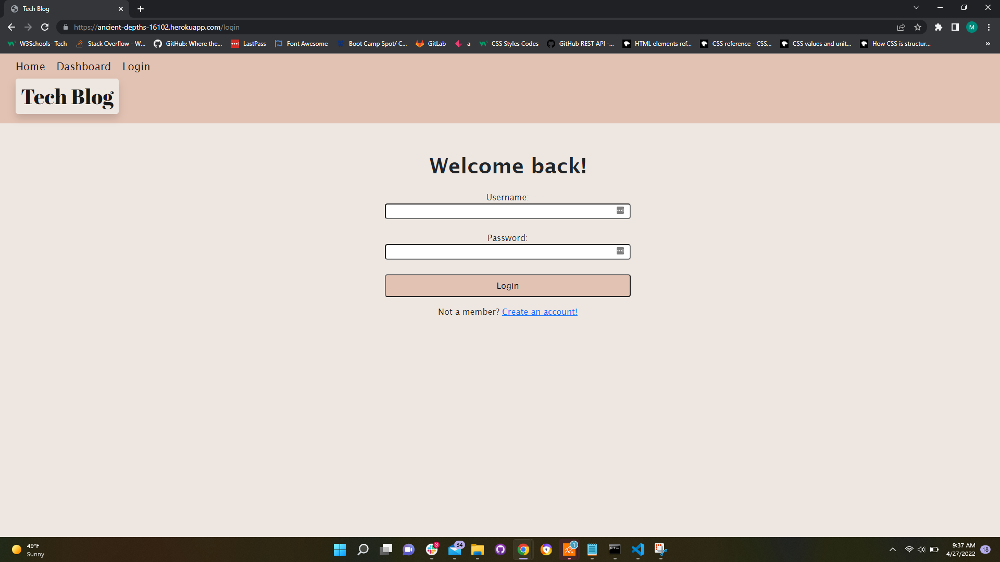
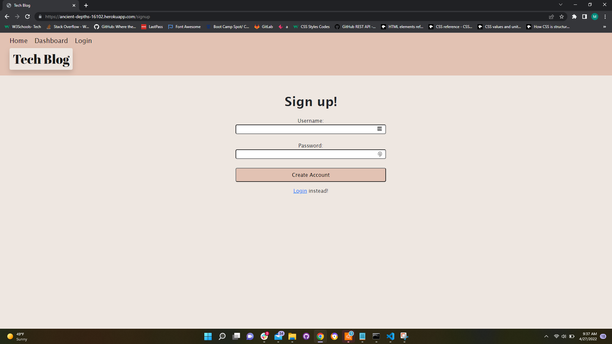
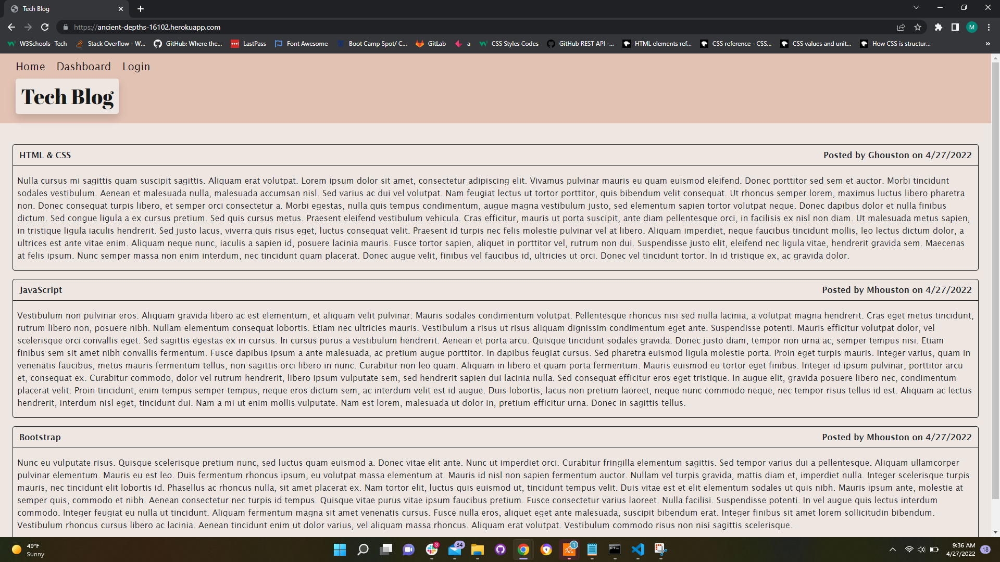
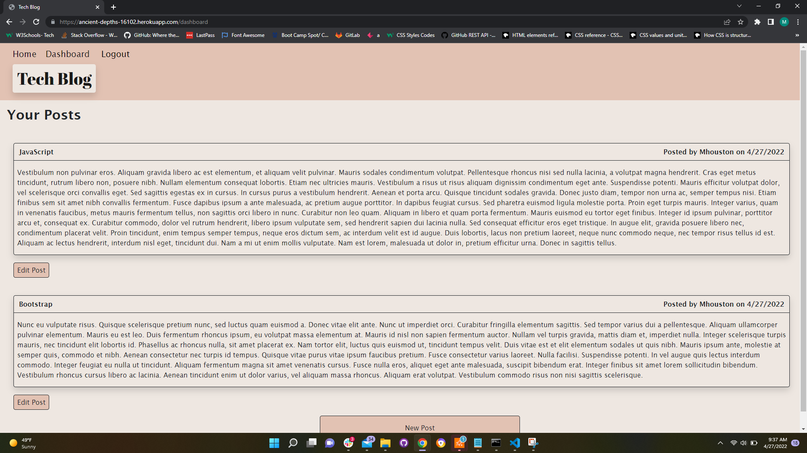
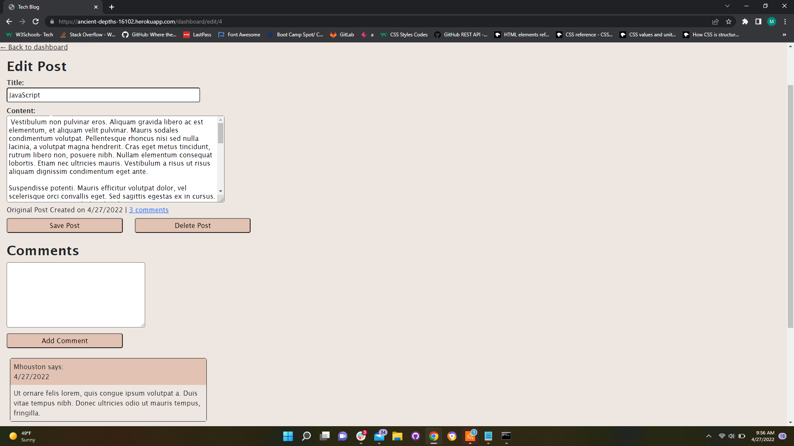

# Tech Blog

## Description
This is a CMS-style blog site where developers can publish their blog posts and comment on other developer's posts as well. Users can also edit and delete their posts and respond to other developers. The goal of this site is to create a community where developers can share technical concepts, recent advancements, and new technologies.

## User Story
```
AS A developer who writes about tech
I WANT a CMS-style blog site
SO THAT I can publish articles, blog posts, and my thoughts and opinions
```

## Screenshots

#### Login Page


#### Sign up Page


#### Homepage


#### Dashboard


#### Edit Page


## Table of Contents
* [Features](#features)
* [Installation](#installation)
* [Contributing](#contributing)
* [Deployed-Application](#deployed-application)
* [Questions](#questions)

## Features
This application has the following features:
1. New users can create an account and their log in credentials are saved to a MySQL database.
2. When logged in, users can create new posts and make comments.
3. When logged in, users can edit and delete their existing posts.
4. When logged in, users can view all of their posts on the dashboard page.
5. Users can view all or individual blogs posts.
6. When a user is idle on the site for more than five minutes, then the user is able to view comments, but is prompted to log in again before they can add, update, or delete comments.

## Installation
1. Clone the repository

```bash
git clone https://github.com/MuboHouston/tech-blog.git
```

2. Change the working directory

```bash
cd tech-blog
```

3. Install dependencies

```bash
npm install
```

4. Run the app

``` bash 
npm start
```

## Contributing 
Contributions, issues, and feature requests are welcome!

## Deployed-Application
https://ancient-depths-16102.herokuapp.com/

## Questions
Find me on GitHub: https://github.com/MuboHouston
